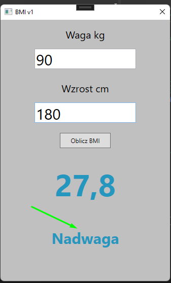

# Specyfikacja Aplikacji BMI

## Cel Aplikacji
Aplikacja BMI (Body Mass Index) służy do obliczania wskaźnika masy ciała na podstawie wagi i wzrostu użytkownika oraz klasyfikowania wyników BMI według kategorii.

## Technologie
- **Język Programowania:** C#
- **Framework:** Windows Presentation Foundation (WPF)
- **Środowisko IDE:** Visual Studio

## Komponenty Aplikacji

### 1. Model (Bmi.cs)
**Cel:** Reprezentuje dane i logikę obliczeń BMI.

**Właściwości:**
- **Weight:** waga w kilogramach
- **Height:** wzrost w centymetrach

**Metody:**
- **Konstruktor:** do inicjalizacji obiektów z wagą i wzrostem.
- **CalculateBmi():** oblicza wartość BMI na podstawie wagi i wzrostu oraz klasyfikuje wynik.

**Walidacja:**
- Sprawdza, czy waga i wzrost są większe od zera.
- Zgłasza wyjątek w przypadku nieprawidłowych danych.

### 2. Interfejs Użytkownika (MainWindow.xaml i MainWindow.xaml.cs)
**Cel:** Zapewnia interakcję użytkownika z aplikacją.

**Elementy:**
- **TextBox:** dla wagi (`txtWeight`), wzrostu (`txtHeight`), wyniku BMI (`txtBmiResult`), i kategorii BMI (`txtBmiCategory`).
- **Button:** do wywołania obliczeń (`ClickBmi`).
- **Label:** dla opisu i komunikatów.

**Logika:**
- Odbieranie danych wejściowych od użytkownika.
- Walidacja danych wejściowych.
- Wyświetlanie wyników i obsługa błędów.

## Działanie Aplikacji
1. **Uruchomienie:** Użytkownik uruchamia aplikację, co otwiera główne okno.
2. **Wprowadzanie Danych:** Użytkownik wprowadza wagę (kg) i wzrost (cm) do odpowiednich pól tekstowych.
3. **Obliczenie BMI:** Użytkownik klika przycisk „Oblicz BMI”.
   - Aplikacja waliduje dane wejściowe.
   - Jeśli dane są prawidłowe, aplikacja używa BmiService do obliczenia BMI i klasyfikacji.
4. **Wyświetlanie Wyników:** Aplikacja wyświetla obliczone BMI oraz kategorię BMI w interfejsie.
5. **Obsługa Błędów:** W przypadku błędnych danych lub problemów z obliczeniami, aplikacja wyświetla komunikat o błędzie.

## Walidacja i Obsługa Błędów
- Walidacja danych wejściowych (sprawdzenie poprawności liczb).
- Obsługa wyjątków związanych z błędami w danych wejściowych (np. ujemne wartości wagi lub wzrostu).

## Nowa Wersja
- **Wersja:** 1.1.0.0
- **Opis Zmian:** Dodano nową metodę `ClassifyBmi(double computedBmi)`, która klasyfikuje obliczone BMI według nowych kategorii. Nowe kategorie BMI obejmują:
  - **Wyglodzenie:** BMI < 16.0
  - **Wychudzenie:** 16.0 ≤ BMI ≤ 16.9
  - **Niedowaga:** 17.0 ≤ BMI ≤ 18.49
  - **Prawidlowa waga 18-65 lat:** 18.5 ≤ BMI ≤ 24.9
  - **Nadwaga:** 25.0 ≤ BMI ≤ 29.9
  - **1-szy stopień otyłości:** 30.0 ≤ BMI ≤ 34.9
  - **2-gi stopień otyłości:** 35.0 ≤ BMI ≤ 39.9
  - **3-ci stopień otyłości:** BMI ≥ 40.0

## Obrazek

